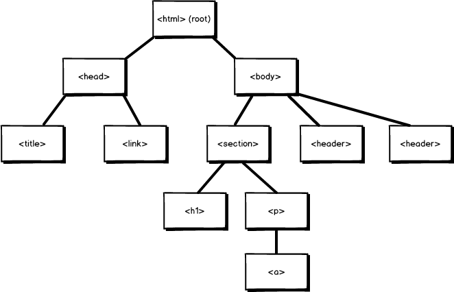

# JavaScript 101

---

## About me

* @ericmasiello
* Fullstack JavaScript Engineer @ Vistaprint Digital
* Instructor for Front-End Web Development at General Assembly
* Co-Author of _Mastering React Native_

--

### Buy Me :)


<a target="_blank" href="https://www.amazon.com/gp/product/1785885782/ref=as_li_tl?ie=UTF8&camp=1789&creative=9325&creativeASIN=1785885782&linkCode=as2&tag=ericmasiello-20&linkId=0b797f6960a050d6567fd26505307fec">Mastering React Native</a>

--

### Your turn to share :)

---

## Agenda

1. Introduction to programming
2. What is JavaScript?
3. JavaScript & the DOM
4. JavaScript syntax
5. Responding to "events"
6. BONUS: JavaScript variables and data types
7. BONUS: Node.js

---

## Introduction to programming

The computer will do what you tell it to do.

--


### What is a program?

A __program__ is a set of instructions that you write to tell a computer what to do

--

### What is programming

__Programming__ is the task of writing those instructions in a language that the computer can understand.


--

### Becoming a programmer

It isn't about the programming language - it's a way of thinking.

--

### How computers 'think'

__They don't__.

* They pretend to by sequentially executing simple instructions.
* The only things a computer knows are the things we tell it.

-- 

### Low-level programming language
Assembly Code

```
global  _start
section .text
_start:
    ; write(1, message, 13)
    mov     rax, 1
    mov     rdi, 1
    mov     rsi, message
    mov     rdx, 13
    syscall
    write
    ; exit(0)
    mov     eax, 60
    xor     rdi, rdi
    syscall
message:
    db      "Hello, World", 10
```

--

### High-level programming language
JavaScript

```
alert('Hello, World!')
```

---

## What is JavaScript?

- Insanely popular
- High level syntax, low barrier to entry
- The only language that runs in the browser
- Can be used "server-side" or "client-side"

Note:

- Hasn't always been only browser language, nor will it always be (probably)
- Runs on the server, in robots, databases, etc

--

### In the beginning, there was HTML


<small>Credit: A Look Back at 20+ Years of Website Design - Myia Kelly</small>

Note:

- Internet predates web pages (developed by military and universities for information sharing)
- WWW and HTML invented at CERN in the late 80s, early 90s in large part by Tim Berners-Lee
- No styles, no interactivity - just text and links

--

### Make it pretty(ish)


<small>Credit: A Look Back at 20+ Years of Website Design - Myia Kelly</small>

--

### Make it interactive!


Note:

- JavaScript was developed in 10 days by one developer (Brendan Eich) for Netscape. It needed to be done quickly so that it could gain adoption over Microsoft's browser language.
- Has evolved enormously since 1995 when it was created

--

## Java vs. JavaScript

Very, very, very different.

(But a little similar)

Note:

- Two completely different languages
- At around the time time JavaScript was created, Java was newish and had a lot of buzz
- The language was originally named as LiveScript
- Netscape renamed it to JavaScript to capitalize on the cachet of Java at the time
- If you ever do a job interview, don't confuse these two languages

---

## JavaScript & the DOM

--

## JavaScript in the wild

- [Form Validation](http://formvalidation.io/examples/adjusting-feedback-icon-position/)
- [Dynamic Navigation](https://generalassemb.ly/education/digital-marketing)
- [UI Component Library](https://websdev.github.io/stencil)

--

### DOM

* Document Object Model
* Tree structure
* Allows JavaScript to read or manipulate the HTML of a webpage

Note:
- This includes changing CSS properties
- Or adding/removing CSS classes from HTML elements

--

### The family tree in code

```html
<html>
    <head>
        <title>The Title</title>
        <link rel="stylesheet" href="css/styles.css">
    </head>
    <body>
        <header>...</header>
        <header>...</header>
        <section>
            <h1>My Website!</h1>
            <p>lorem ipusm <a href="#">dolar</a></p>
        <section>
    </body>
</html>
```

--

### The family tree visualized



---

## Syntax

__Syntax:__ Spelling and grammar rules of a programming language. 


Note:
Like with any language, there are formal rules around how to write it. This is the syntax.

--

### JavaScript syntax examples

* Semicolon - end of a statement
* Quotation Marks - a String (of characters)

```javascript
document.getElementById('stopButton').onclick = illuminateRed;
```

--

### JavaScript syntax - comments

```javascript
// Single Line Comments
```

```javascript
/*
Multi
line
comments
*/
```

--

### "Comment out"
Use comments to stop the program from running one or more lines of code

```js
// This line runs
console.log('Hello world!');

// These are commented out
// console.log('Hello FEWD');
// console.log('Hello GA');
```

---

## Responding to &ldquo;events&rdquo;

`event + event handler => run some code`

Note:
- Let's cover some basic definitions

--

### Event

A user interaction

e.g. click, scroll, mouseover, etc.

--

### Event listener/handler

A `function` whose job is to respond to some user input.

--

### Function

A named, self-contained set of instructions that is reusable. A "recipe" in our programming-as-cooking metaphor.

```javascript
function makeGrilledCheese() {
  ...
}
```

Functions can be easily rerun (e.g. on every click, run these instructions)

--

### Example

```js
document.getElementById('stopButton').onclick = function() {
 // do stuff!
}
```

---

## How we solve problems in JavaScript

1.  Find some elements on the page
2.  Listen for some user interaction (click, scroll, mouseover)
3.  Respond to that event
    - Add, remove or modify HTML
    - Add, remove or modify CSS
    - or anything else :)

--


--


--


--


--


--


---


## Traffic light

http://codepen.io/ericmasiello/pen/vxbgXo
- Fork this on Codepen

---

## BONUS: Variables & data types

--

### Variables

JavaScript variables are containers for storing data values.

--

### Variables

```javascript
var a = 13;
```

--

### Variables

We can tell our program to remember values for us to use later on.

The action of saving a value to a variable is called assignment.

--

### Variable declaration

* Tell our program that we wish to make a variable
* We choose the name

```javascript
var a;
```

--

### Variable assignment

* Give our declared variable a value

```javascript
a = 13;
```

--

### Variable assignment and declaration

```javascript
// Do assignment and declaration separately
var a;
a = 13;

// Do assignment and declaration at the same time
var b = a + 2;
```

--

### Variable reassignment

```javascript
var a = 'Eric';

a = 'Erika';
```

--

### Variable naming conventions

Use "camel case":
- start with lower case letter
- each new word is capitalized

```javascript
var numberOfStudents = 20;
```

---

## Data types

Parts of variable:

```js
var numberOfStudents = 20;
```

- name: `numberOfStudents`
- value: `20`

--

### Data types

What can those _values_ be??

--

### JavaScript data types

- *Number*
- *String*
- *Boolean*
- Undefined
- Null
- Object
- Function

--

### Number

```javascript

// We call this type of number an "integer"
var myInteger = 10;

// And this type a "float"
var myFloat = 10.13093;

var sum = myInteger + myFloat;
```

--

### Common JavaScript Math Operators

| Operator        | Description           | Example  |
| ------------- |:-------------:| -----:|
| `+`      | Addition | `x = y + 2;` |
| `-`      | Subtraction | `x = y - 2;` |
| `*`      | Multiplication | `x = y * 2;` |
| `/`      | Division | `x = y / 2;` |
| `%`      | Modulus (division remainder) | `x = y % 2;` |

--

### String

Text, a collection of characters.

```javascript

var firstName = 'Eric';

var lastName = 'Masiello';

var fullName = firstName + ' ' + lastName;
```

Note:

This operation is called concatenation

--

### Boolean

True or False

```javascript

var lightOn = true;

function turnLightsOff() {
  lightOn = false;
}
```

---


## Score keeper

[CodePen](https://codepen.io/ericmasiello/pen/VWXWEB?editors=1010)
- Fork this on Codepen

---

## BONUS: Node.js


--

### Node.js
* Developed in 2009
* Built on top of Google Chrome's _V8_ JavaScript engine
* Open source runtime environment for running server-side JavaScript applications
* Install it from https://nodejs.org/

--

### Sample Node app

* Copy this code http://bit.ly/2tpAOXZ
* Save as add.js
* Open your command line tool
```
node add.js 3 4
```

---

## Resources

### Books
* [You Don't Know JS: Up & Going](http://shop.oreilly.com/product/0636920039303.do)
* [HTML and CSS: Design and Build Websites](https://www.amazon.com/HTML-CSS-Design-Build-Websites/dp/1118008189/ref=sr_1_2?ie=UTF8&qid=1502034868&sr=8-2&keywords=html+css+javascript)

### Online
* [Code Academy (Free)](https://www.codecademy.com/)

### In Person Courses
* [Web Development Immersive (Full Time)](https://generalassemb.ly/education/web-development-immersive)
* [Front End Development (Part time)](https://generalassemb.ly/education/front-end-web-development)
* [JavaScript (Part Time)](https://generalassemb.ly/education/javascript-development)

---

## Thank you!

