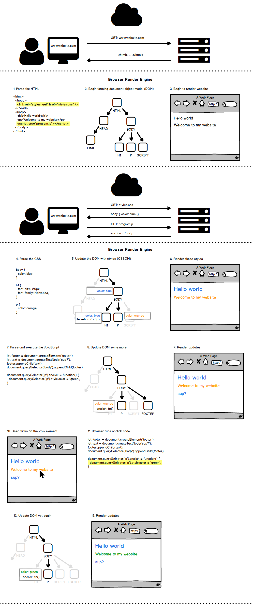
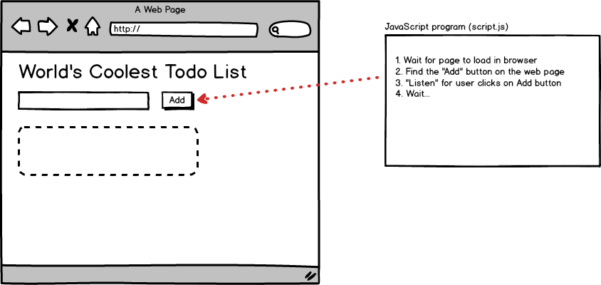
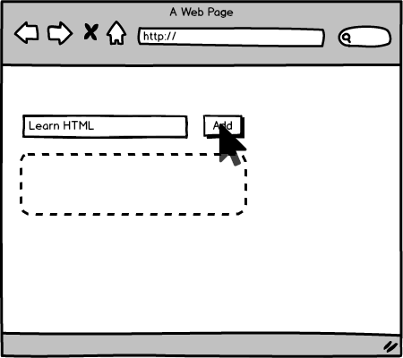
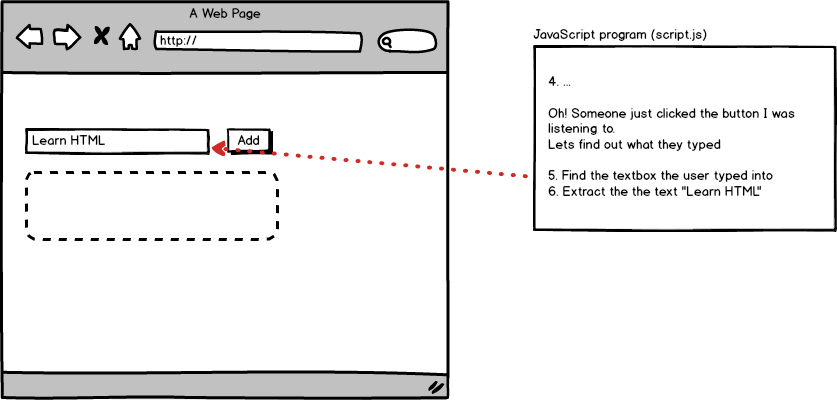
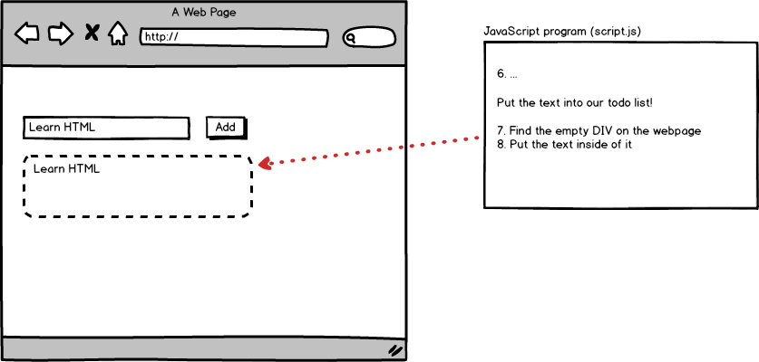
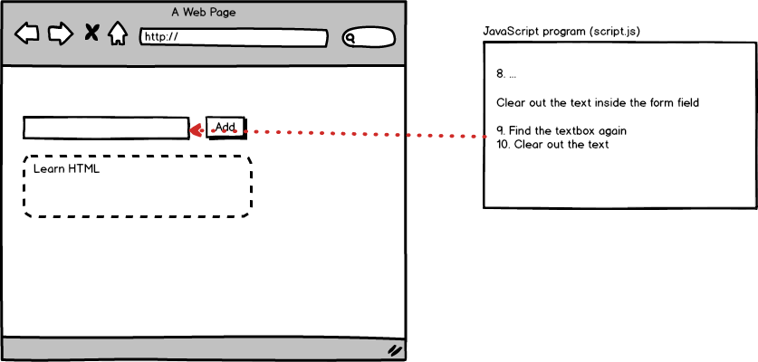
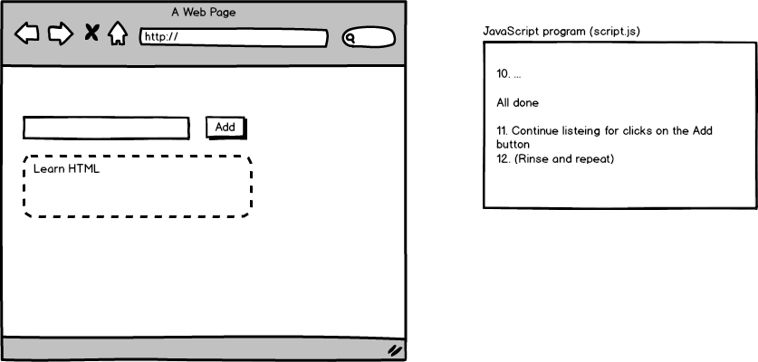

# JavaScript 101

---

## My name is Jay

* [@inkpixelswords](https://twitter.com/inkpixelswords)
* Design Director at Bivee
* I live in Ellicott City (near Baltimore) with my wife, daughter, and giant dog
* I love pictures, words, and all the ways they can work together

---

## Agenda

1. What is JavaScript?
2. JavaScript & the DOM
3. JavaScript syntax
4. Responding to "events"
5. JavaScript variables and data types
6. BONUS: Node.js

---

## Setting expectations

- This is a beginner class and we'll stick to basics
- Only assuming basic knowledge of HTML and CSS
- There will be a Q&A session at the end


---

### Becoming a programmer

It isn't about the programming language - _it's a way of thinking._

---

## What is JavaScript?

- Insanely popular
- High level syntax, low(ish) barrier to entry
- One of two languages that run in the browser (the other is WebAssembly)
- Can be used "server-side" or "client-side"

Note:

- High level syntax means you don't need to program to the specific hardware, the language is more generalized and typically easier to write
- Hasn't always been only browser language, nor will it always be (probably)
- Runs on the server, in robots, databases, etc

--

### In the beginning, there was HTML


<small>Credit: A Look Back at 20+ Years of Website Design - Myia Kelly</small>

Note:

- Internet predates web pages (developed by military and universities for information sharing)
- WWW and HTML invented at CERN in the late 80s, early 90s in large part by Tim Berners-Lee
- No styles, no interactivity - just text and links

--

### Make it pretty(ish)


<small>Credit: A Look Back at 20+ Years of Website Design - Myia Kelly</small>

--

### Make it interactive!


Note:

- JavaScript was developed in 10 days by one developer (Brendan Eich) for Netscape. It needed to be done quickly so that it could gain adoption over Microsoft's browser language.
- Has evolved enormously since 1995 when it was created

--

## Java vs. JavaScript

Very, very, very different.

(But a little similar)

Note:

- Two completely different languages
- At around the time time JavaScript was created, Java was newish and had a lot of buzz
- The language was originally named as LiveScript
- Netscape renamed it to JavaScript to capitalize on the cachet of Java at the time
- If you ever do a job interview, don't confuse these two languages

--

## JavaScript vs. Javascript

- Officially, its "JavaScript"
- In reality, no one cares

<style type="text/css">
#javascript-vs-javascript {
    text-transform: none;
}
</style>

---

## What's the DOM?

--

## Browser rendering in action

[](img/browser-rendering-dom-diagram.png)

--


## DOM: Document Object Model

> Essentially, the DOM is an internal data structure managed by web browsers that represents what you _actually_ see when you look at any web page. It takes **HTML**, **CSS**, and instructions written in **JavaScript** to decide what it should display at any moment.

--

## DOM: Document Object Model

- Tree data structure managed by the web browser
- Exposes an "API" to JavaScript allowing web developers to:
 - Manipulate what is rendered to the screen
 - Respond to interactions (e.g. specify what happens when a user clicks)

Note:

- DOM is techncially not part of the JavaScript language. Its part of the browser

---

## `document` object

 - Browser exposes the DOM to JavaScript via the `document` object
 - Most of what you do with client-side JavaScript revolves around manipulating the DOM via the `document` object

 ```js
// Create a <p> node
var pNode = document.createElement('p');
// Create a text node
var textNode = document.createTextNode('Hello world');
// Append the text to <p>
pNode.appendChild(textNode);
// Append <p>Hello world</p> to <body>
document.querySelector('body').appendChild(pNode);
```

-- 

## Getting data from the DOM

| Method Name | Description |
| --- | --- |
| `.getElementById()` | Gets a single element by an ID selector |
| `.querySelector()` | Gets a single element matching the selector |
| `.querySelectorAll()` | Gets a list of elements matching the selector |
\* There are additional methods for getting DOM nodes

--

## `getElementById`

```html
<html>
  <body>
    <h1 id="title">The title</h1>
    <p class="message">foo</p>
    <p>bar</p>
    <p class="message">baz</p>
  </body>
</html>
```

```js
// returns a single Node
var titleElement = document.getElementById('title');
```

--

## `querySelector`

```html
<html>
  <body>
    <h1 id="title">The title</h1>
    <p class="message">foo</p>
    <p>bar</p>
    <p class="message">baz</p>
  </body>
</html>
```

```js
// returns a single Node
var titleElement = document.querySelector('#title');

// returns a single Node, but which one?
var messageElement = document.querySelector('.message');
```

--

## `querySelectorAll`

```html
<html>
  <body>
    <h1 id="title">The title</h1>
    <p class="message">foo</p>
    <p>bar</p>
    <p class="message">baz</p>
  </body>
</html>
```

```js
// returns a NodeList of 2 elements
var messageElements = document.querySelectorAll('.message');

// returns a NodeList of 3 elements
var allParagraphElements = document.querySelectorAll('p');
```

--

## JavaScript in the wild

- [Form Validation](https://formvalidation.io/guide/plugins/bootstrap/)
- [Dynamic Navigation](https://generalassemb.ly/education/digital-marketing)

---

### How do we add JavaScript to a webpage?

### `<script></script>`

--

```html
<!DOCTYPE html>
<html>
  <head>
    <link rel="stylesheet" type="text/css" href="css/styles.css">
  </head>
  <body>
    <!-- your webpage contents -->
    ...

    <script src="script.js"></script>
  </body>
</html>
```
Put it right before the closing `</body>` element

---

## Syntax

"...set of rules that defines the combinations of symbols that are considered to be a correctly structured \[code\] in that language."

\- [Wikipedia](https://en.wikipedia.org/wiki/Syntax_(programming_languages))


Note:
Like with any language, there are formal rules around how to write it. This is the syntax.

--

### JavaScript syntax examples

* Semicolon - end of a statement
* Quotation Marks - a String (of characters)

```javascript
function illuminateRed() {
    // do stuff
}

function setupEvents() {
    document.getElementById('stopButton').onclick = illuminateRed;
}

setupEvents();
```

--

### JavaScript syntax - comments

```javascript
// Single Line Comments
```

```javascript
/*
Multi
line
comments
*/
```

--

### "Comment out"
Use comments to stop the program from running one or more lines of code

```js
// This line runs
console.log('Hello world!');

// These are commented out
// console.log('Hello FEWD');
// console.log('Hello GA');
```

--

### Basic JavaScript Syntax

[https://www.w3schools.com/js/js_syntax.asp](https://www.w3schools.com/js/js_syntax.asp)

---

## Responding to &ldquo;events&rdquo;

`event + event handler => run some code`

Note:
- Let's cover some basic definitions

--

### Event

Typically a user interaction

e.g. click, scroll, mouseover (hover), etc.

```html
<!-- I want to know when someone clicks on this button -->
<button id="dealButton">Deal cards!</button>
```

--

### Event listener/handler

A `function` whose job is to respond to some user input.

```js
// I want to know whenever someone *clicks* on the element
// with an id of "dealButton"
```

--

### Function

A self-contained set of instructions that can be reusable

```javascript
function dealRandomCard() {
  // code here that picks a card at random
}
```

Functions can be easily rerun (e.g. on every click, run these instructions)

--

### Example

JS
```js
function dealRandomCard() {
  // code here that picks a card at random
}

// whenever someone clicks the html tag with an id="dealButton",
// run the dealRandomCard function
document.querySelector('#dealButton').onclick = dealRandomCard;
```
HTML
```html
<!-- I want to know when someone clicks on this button -->
<button id="dealButton">Deal cards!</button>
```
---

## How we solve problems in the browser with JavaScript

1.  Find some elements on the page
2.  Listen for some user interaction (click, scroll, mouseover)
3.  Respond to that event
    - Add, remove or modify HTML
    - Add, remove or modify CSS
    - or anything else :)

--



--



--



--



--



--



---


## Traffic light

http://codepen.io/ericmasiello/pen/vxbgXo
- Fork this on Codepen

--

## Traffic light Assignment
*15 mins*
1. Make the slow button turn the 2nd light yellow
2. Make the go button turn the last light green
3. **BONUS:** Make it so that I can click the lights themselves to turn them on

*If you finish early, help others around you if they're stuck.*

---

## Variables & data types

--

### Variable

Containers for storing data values.

```javascript
var age = 13;
```

--

### Variable declaration

* `var` keyword tells our program that we wish to make a variable
* We choose the name
* Variables should only be _declared_ once

```javascript
var age;
```

--

### Variable assignment

* Give our declared variable a value
* This can happen multiple times

```javascript
age = 13;
```

--

### Variable assignment and declaration

```javascript
// Do assignment and declaration separately
var a;
a = 22;

// Do assignment and declaration at the same time
var b = a + 2;
```

--

### Variable reassignment

```javascript
var a = 'Eric';

a = 'Erika';
```

--

### Name variables using "camelcase"

- Start with lowercase letter
- Each new word is capitalized

```javascript
var numberOfStudents = 20;
```

--

### Variable naming rules (syntax)

- Names can contain letters, digits, underscores, and dollar signs
- Names must begin with a letter, $, or _
- Names are case sensitive (y and Y are different variables)
- Reserved words (e.g. `function` or `while`) cannot be used as names

---

## Data types

--

### Breaking down this line of code

```js
var numberOfStudents = 20;
```

- JavaScript reservered word: `var`
- Name: `numberOfStudents`
- Value: `20`

--

### Data types

What can those _values_ be??

--

### JavaScript data types

- *Boolean*
- Null
- Undefined
- *Number*
- *String*
- Symbol
- Object\* 

\* includes Dates, Arrays, Regular Expressions, Functions, and more

--

### Number

```javascript

// We call this type of number an "integer"
var myInteger = 10;

// And this type a "float"
var myFloat = 10.13093;

var sum = myInteger + myFloat;
```

--

### Common JavaScript Math Operators

| Operator        | Description           | Example  |
| ------------- |:-------------:| -----:|
| `+`      | Addition | `x = y + 2;` |
| `-`      | Subtraction | `x = y - 2;` |
| `*`      | Multiplication | `x = y * 2;` |
| `/`      | Division | `x = y / 2;` |
| `%`      | Remainder | `x = y % 2;` |

[JavaScript Arithmetic Operators](https://developer.mozilla.org/en-US/docs/Web/JavaScript/Reference/Operators/Arithmetic_Operators)

--

### String

Text, a collection of characters.

```javascript

var firstName = 'Eric';

var lastName = 'Masiello';

// fullName = 'Eric Masiello'
var fullName = firstName + ' ' + lastName;
```

Note:

This operation is called concatenation

--

### Boolean

True or False

```javascript

var lightOn = true;

function turnLightsOff() {
  lightOn = false;
}
```

---


## Score keeper

[CodePen](https://codepen.io/ericmasiello/pen/VWXWEB?editors=1010)
- Fork this on Codepen

--

## Score keeper Assignment
*15 mins*
1. Add a button labeled "Double" that takes the current score and doubles it
2. Add a button labeled "Half" that takes the current score and cuts it in half

*If you finish early, help others around you if they're stuck.*

---

## BONUS: Node.js


--

### Node.js
* Developed in 2009
* Built on top of Google Chrome's _V8_ JavaScript engine
* Open source runtime environment for running server-side JavaScript applications
* Install the _LTS_ version from https://nodejs.org/

--

### Sample Node app

* Copy this code http://bit.ly/2tpAOXZ
* Save as add.js
* Open your command line tool
```
node add.js 3 4
```

---

## Please share your feedback

[www.ga.co/introclass](www.ga.co/introclass)

(Mobile- and laptop-friendly)

---

## Resources

* _Books_
* [You Don't Know JS: Up & Going](http://shop.oreilly.com/product/0636920039303.do)
* [HTML and CSS: Design and Build Websites](https://www.amazon.com/HTML-CSS-Design-Build-Websites/dp/1118008189/ref=sr_1_2?ie=UTF8&qid=1502034868&sr=8-2&keywords=html+css+javascript)
* _Online_
* [Code Academy (Free)](https://www.codecademy.com/)
* [JavaScript 30 (Free)](https://javascript30.com/)
* _In Person Courses_
* [Web Development Immersive (Full Time)](https://generalassemb.ly/education/web-development-immersive)
* [Front End Development (Part time)](https://generalassemb.ly/education/front-end-web-development)
* [JavaScript (Part Time)](https://generalassemb.ly/education/javascript-development)

---

## Thank you!

